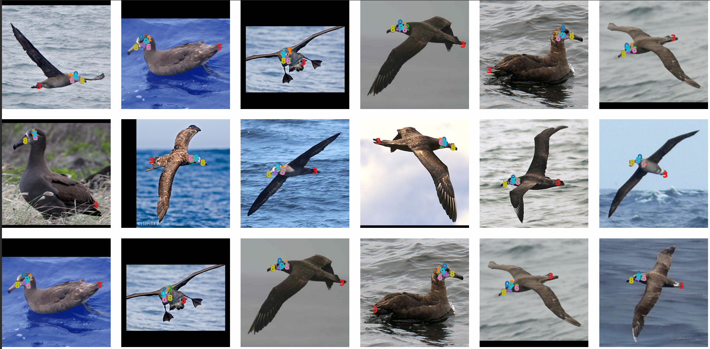
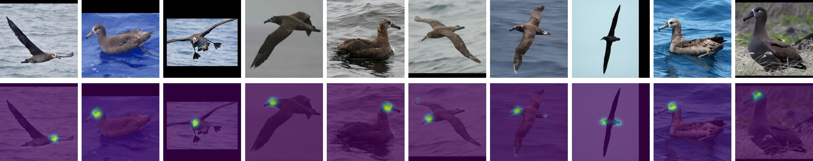
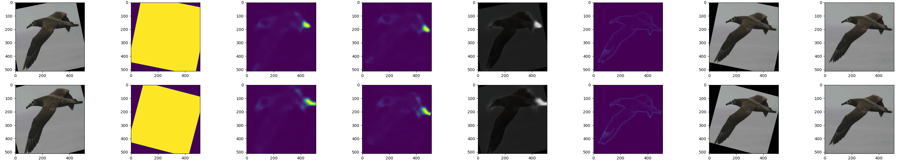

# StableXLKeypoints

**中文 | [English](README_EN.md)**

## 简介

`StableXLKeypoints` 在 `StableImageKeypoints` 的基础上，补全并完善了对 `Stable Diffusion XL`（SDXL）的适配，完成了此前 `StableKeypoints` 未完成的部分。本项目仅支持 SDXL 及其微调模型；如果你在寻找适用于 Stable Diffusion v1/v2 的版本，[请看这里](https://github.com/Aloento/StableImageKeypoints/tree/v1.5)。

## 特性与改进

- 适配 `AttnProcessor 2.0`，兼容 SDXL 的注意力实现。
- 面向 SDXL 的 CFG 与双文本编码器路径优化。
- 关键点定位更稳定、更准确，语义一致性更强。

  - 得益于 SDXL 的双 CLIP 文本编码器，我们观察到显著更稳定的语义对应关系：

    在结果中可以看到，编号 3 始终指向尾羽，8 指向喙，9 指向眼角等，这些在 v1.5 中并不稳定的指向在 SDXL 下更一致。

- 关键点更倾向于聚焦训练数据中的共有结构（如头部）。
- 收敛速度与 v1.5 基本一致，显存占用控制良好。

> 请不要使用 FP16 变体。当前未做 FP16 兼容，涉及修改点较多，而且很容易出现梯度消失问题。

## 结果展示

## 使用方法

用法与 v1.5 完全一致。请参考 v1.5 的「[快速开始](https://github.com/Aloento/StableImageKeypoints/blob/v1.5/README.md#%E5%BF%AB%E9%80%9F%E5%BC%80%E5%A7%8B)」部分，按相同步骤配置与运行。

## 研究备忘与思考

- 关于传递给 `CLIP ViT-G/14`（第二个文本编码器）的张量 `add_text_embeds`：

  如果你感兴趣，可以尝试在进行 mean 之前将其拆分为两部分，再分别送入或采用不同融合策略，这可能带来不同的效果。目前本实现依赖反向传播自动学习，尚未对其显式建模，这种操作或许会对第一个文本嵌入（`CLIP ViT-L/14`）产生耦合影响。

- 我不计划为本研究单独撰写论文，因此不在此做形式化论证；欢迎你亲自尝试并基于此继续探索。
- 从工作量与难度上看，本项目大致相当于一般意义上的本科毕业设计。希望这个改进版对你的研究有所帮助，也欢迎基于此继续优化与拓展。
