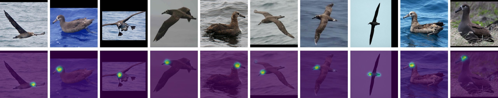

# StableXLKeypoints

**[中文](README.md) | English**

## Overview

`StableXLKeypoints` builds upon `StableImageKeypoints` to fully adapt and enhance support for `Stable Diffusion XL` (SDXL), completing the parts that were unfinished in the earlier `StableKeypoints`. This project supports only SDXL and its fine-tuned models. If you’re looking for a version for Stable Diffusion v1/v2, please see [here](https://github.com/Aloento/StableImageKeypoints/blob/v1.5/README_EN.md).

## Features & Improvements

- Adapted to `AttnProcessor 2.0` and compatible with SDXL’s attention implementation.
- Optimized CFG and dual text-encoder pathways specifically for SDXL.
- More stable and accurate keypoint localization with stronger semantic consistency.
  - Thanks to SDXL’s larger text embeddings, we observe significantly more stable semantic correspondences:
    In the results, index 3 consistently points to tail feathers, 8 to the beak, and 9 to the eye corner, etc. These correspondences were unstable in v1.5 but are more consistent under SDXL.
- Keypoints tend to focus on common structures in the training data (e.g., the head).
- Convergence speed is roughly on par with v1.5, with well-controlled VRAM usage.

> Please do not use FP16 variants. FP16 compatibility has not been implemented. It involves many changes and can easily lead to vanishing gradients.

## Results

## Usage

Usage is identical to v1.5. Please refer to the “[Quick Start](https://github.com/Aloento/StableImageKeypoints/blob/v1.5/README_EN.md#quick-start)” section in v1.5 and follow the same steps to configure and run.

## Notes

- I do not plan to write a separate paper for this study, so there won’t be a formal derivation here. You’re welcome to experiment and build upon this work.

- In terms of workload and difficulty, this project is roughly equivalent to a typical undergraduate capstone project. I hope this improved version helps your research, and you’re welcome to optimize and extend it further.
